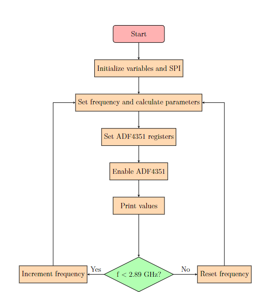

# Introduction
There are 2 files: ADF4351_esp32.cpp is for running the code in ESP32 and the adf4351_example.cpp is for running in the Arduino Uno. For the cpp for the ESP32, it creates a frequency sweep from 2.8 GHz to 2.9 GHz with a frequency sweep step 100 KHz and delay time for changing of the frequency is 0.2 second. The algorithm for this code is shown below:

For the example file, it is a original test file for the use of Arduino Uno to control the ADF4351. It is a simple code to transfer all 6 registers 32 bits value from Arduino Uno to ADF4351 via SPI. It creates output frequency 70 MHz.
# How to Use the C++ Code Files for Arduino Uno and ESP32

## Prerequisites

1. **Download and Install Visual Studio Code (VS Code)**
   - Visit the [official Visual Studio Code website](https://code.visualstudio.com/) and download the appropriate version for your operating system.
   - Follow the installation instructions for your operating system.

2. **Install PlatformIO Extension in VS Code**
   - Open VS Code.
   - Go to the Extensions view by clicking on the Extensions icon in the Activity Bar on the side of the window.
   - Search for "PlatformIO IDE" and click "Install".

## Using the Arduino Uno File (`adf4351_example.cpp`)

### Create a New PlatformIO Project for Arduino Uno

1. Open VS Code.
2. Press `Ctrl+Shift+P` to open the Command Palette and type `PlatformIO: Home`. Select it.
3. In the PlatformIO Home screen, click on "New Project".
4. Enter a name for your project.
5. Select "Arduino Uno" as the board.
6. Ensure the framework is set to "Arduino".
7. Click "Finish" and wait for PlatformIO to create the project and install necessary dependencies.

### Copy the Code to Your Project

1. In the newly created project, navigate to the `src` folder.
2. You will find a `main.cpp` file. Open it.
3. Copy the contents of `adf4351_example.cpp` and paste them into `main.cpp`, replacing any existing code.

### Build and Upload the Code

1. Connect your Arduino Uno board to your computer.
2. In VS Code, open the PlatformIO sidebar by clicking on the alien icon in the Activity Bar.
3. Click on the "Build" button (checkmark icon) to compile the code.
4. After a successful build, click on the "Upload" button (arrow icon) to upload the code to your Arduino Uno.

## Using the ESP32 File

### Create a New PlatformIO Project for ESP32

1. Open VS Code.
2. Press `Ctrl+Shift+P` to open the Command Palette and type `PlatformIO: Home`. Select it.
3. In the PlatformIO Home screen, click on "New Project".
4. Enter a name for your project.
5. Select "Espressif ESP32 Dev Module" or your specific ESP32 board model as the board.
6. Ensure the framework is set to "Arduino" or "ESP-IDF" depending on your code requirements.
7. Click "Finish" and wait for PlatformIO to create the project and install necessary dependencies.

### Copy the Code to Your Project

1. In the newly created project, navigate to the `src` folder.
2. You will find a `main.cpp` file. Open it.
3. Copy the contents of the provided ESP32 C++ code file and paste them into `main.cpp`, replacing any existing code.

### Build and Upload the Code

1. Connect your ESP32 board to your computer.
2. In VS Code, open the PlatformIO sidebar by clicking on the alien icon in the Activity Bar.
3. Click on the "Build" button (checkmark icon) to compile the code.
4. After a successful build, click on the "Upload" button (arrow icon) to upload the code to your ESP32.

## Additional Notes

- **Libraries**: If your code requires additional libraries, PlatformIO usually manages these dependencies automatically. However, you may need to manually add some libraries to your `platformio.ini` configuration file or use the Library Manager in PlatformIO.
- **Serial Monitor**: You can use the built-in Serial Monitor in PlatformIO to view serial output from your board. Click on the "Serial Monitor" button (plug icon) in the PlatformIO sidebar.

By following these steps, you should be able to set up, build, and upload the provided C++ code files to both the Arduino Uno and ESP32 using VS Code and the PlatformIO extension.
# Appendix
[4.4GHz RF Synthesizer Board - ADF4351 - Theory, Setup, Reverse Engineering, Experiments](https://www.youtube.com/watch?v=xJ0Mfuj0KUQ&t=4658s)
[ADF4351 Musings and Experiments](https://www.youtube.com/watch?v=ZrB41SkXX4c)-I create the code for the esp32 which calculates the necessary parameters such as INT, MOD, FRAC, DIV to output exact frequency based on the VB script from the excel sheet provided in the link of youtube.
