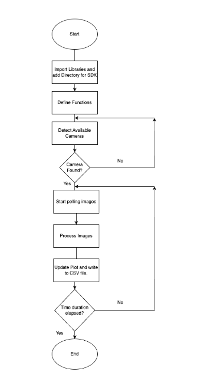

# Introduction
The CMOS camera used in the NV center setup is Cs165mu thorlabs. This is the folder contains all libraries, data files(csv files), image files and the Python code file for the Cs165mu thorlabs camera. The zip file Scientific_Camera_Interfaces.zip contains all libraries, SDK software, and example for the Cs165mu thorlabs camera. The main python file for the project is nv-center-camera.py. Its main function is to both collect light intensity data from the camera via USB and frequency data from the ESP32 via Serial port which is COM port in Window. 
The algorithm for the nv-center-camera.py is shown below:
  
The result of the nv-center-camera.py file is the plot between the light intensity and frequency. It is shown below:
 
# Instructions to Use the Python Code for Fluorescence Intensity Analysis

## Prerequisites

### 1. Install Python
Ensure that you have Python installed on your system. You can download it from the [official Python website](https://www.python.org/downloads/).

### 2. Install Required Python Libraries
The following Python libraries are required for the script:

- `numpy`
- `opencv-python`
- `matplotlib`
- `pyserial`
- `thorlabs_tsi_sdk` which is provided in the SDK/Python Toolkit.

You can install these libraries using `pip`. Open your terminal or command prompt and run the following commands:

```sh
pip install numpy
pip install opencv-python
pip install matplotlib
pip install pyserial
```
### 3. Download and Install Thorlabs Camera SDK
Ensure that you have the Thorlabs Camera SDK installed. You can download it from the Thorlabs website or unzip the Scientific_Camera_Interfaces.zip file.
After installing the SDK, make sure to add the DLL directory to your system path as specified in the script:

```python
os.add_dll_directory(r"C:\Program Files\Thorlabs\Scientific Imaging\Scientific Camera Support\Scientific_Camera_Interfaces\Scientific Camera Interfaces\SDK\Python Toolkit\dlls\64_lib")
```
### 4. Connect Your Camera and Serial Device
Ensure that your Thorlabs camera and the serial device (for frequency measurement) are properly connected to your computer.

Running the Script
1. Set Up Your Environment
Open your preferred Python development environment or text editor (e.g., VS Code, PyCharm).

2. Adjust Serial Port Configuration
Update the serial port configuration in the script to match your setup. Modify the ser.port to the appropriate COM port your serial device is connected to:

```python
ser.port = 'COM3'  # Change 'COM3' to your serial device's COM port
```
### 4. Run the Script
Run the script by executing the Python file. In your terminal or command prompt, navigate to the directory where your script is saved and run:
```sh
python nv-center-camera.py
```
### 5. Monitor Output and Data Collection
The script will start capturing images, analyzing fluorescence intensity, and logging data. You can monitor the output in the console and observe the real-time plot of fluorescence intensity versus frequency.

### 6. Data Storage
The script will save the collected data in a CSV file named fluorescence_data_intensity_frequency_2.csv. You can open this file with any spreadsheet software (e.g., Excel) for further analysis.

### 7. Completion
Once the experiment duration is complete, the script will stop, and the plot will be displayed. The program will print "Program completed" to indicate the end of the process.

Additional Notes
Ensure that the camera and serial device are properly connected and recognized by your computer before running the script.
If you encounter any issues with the DLL path, verify that the path is correct and that the DLL files are present in the specified directory.
You can modify the total_duration and time_step variables in the script to change the experiment duration and measurement intervals.
By following these steps, you should be able to successfully run the provided Python script for fluorescence intensity analysis.