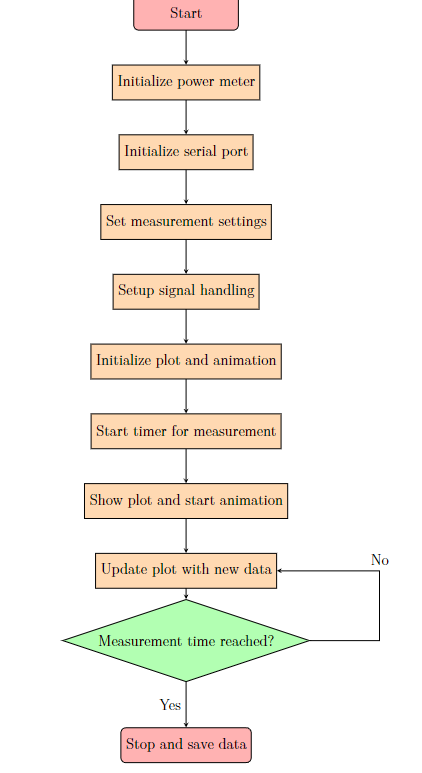
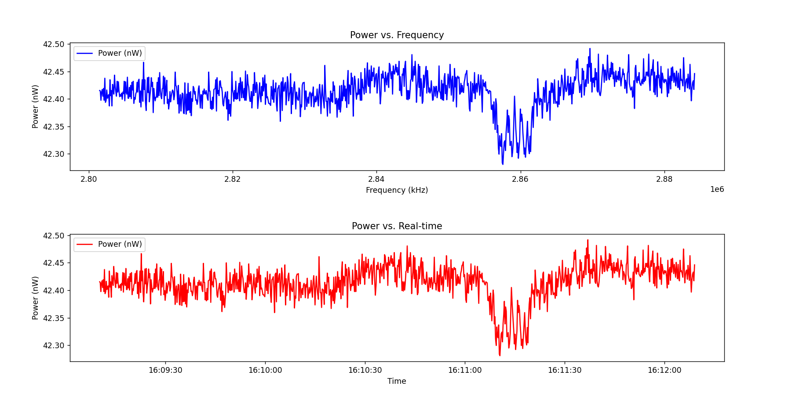

# Introduction
This folder contains thoses files:THORLAB_PM100_USB_DISK.zip , requirements.txt, data.csv, and 2 Python files. The main file used in the project is powermeter_plot_realtime.py. Its main function is to collect data power output from the Thorlab powermeter Thorlab PM100USB via USB and frequency data from ESP32 via Serial port, which is COM port in Window. The algorithm of the code is shown below:  
  
The result is 2 plots: power vs frequency and power vs real-time:

# Instructions to Use the Python Code for Power Measurement and Data Visualization

## Prerequisites
### 1. Install Thorlab PM 100USB utility
The provided zip file THORLAB_PM100_USB_DISK.zip contains all files which includes installer file, library files and driver files. After unzipping the file, user need to install the application first. Go to Application/PM100D-PM200 Utility Installer folder, and run the installer file which is the setup. It will install all necessary files and library files. After that, user goes to Driver folder, user can choose between 32bits or 64bits driver, I recommend 64bits as all cpu are 64bits now. After that, user run the setup application which will install driver. After installing driver, user must restart the computer so that both the software and driver take effect.
### 2. Install Python
Ensure that you have Python installed on your system. You can download it from the [official Python website](https://www.python.org/downloads/).

### 3. Install Required Python Libraries
The following Python libraries are required for the script:

- `pyserial`
- `numpy`
- `pyvisa`
- `ThorlabsPM100`
- `matplotlib`

You can install these libraries using `pip`. The requirements.txt file is to contain the name of all necessary libaries to run 2 Python code. Open your terminal or command prompt and run the following commands:
```sh
pip install -r requirements.txt
```
It will automatically install all necessary libaries to run 2 Python files. The example file is from Thorlab to run their example. The file powermeter requires user to connect both thorlab powermeter and esp32 to run. For more information about thorlab powermeter Python API: https://pypi.org/project/ThorlabsPM100/

### 4. Connect Your Thorlabs Power Meter and Serial Device
Ensure that your Thorlabs power meter and the serial device (for frequency measurement) are properly connected to your computer.

## Running the Script
### 1. Set Up Your Environment
Open your preferred Python development environment or text editor (e.g., VS Code, PyCharm).

### 2. Copy and Paste the Code
Copy the provided Python script.

### 3. Adjust Serial Port Configuration
Update the serial port configuration in the script to match your setup. Modify the ser.port to the appropriate COM port your serial device is connected to:

```python
ser.port = 'COM5'  # Change 'COM5' to your serial device's COM port
```
### 4. Run the Script
Run the script by executing the Python file. In your terminal or command prompt, navigate to the directory where your script is saved and run:
```sh
python powermeter_plot_realtime.py
```
### 5. Monitor Output and Data Collection
The script will start measuring power, reading frequencies from the serial port, and logging data. You can monitor the output in the console and observe the real-time plots of power versus frequency and power versus time.

### 6. Data Storage
The script will save the collected data in a CSV file named data.csv. You can open this file with any spreadsheet software (e.g., Excel) for further analysis.

### 7. Completion
Once the measurement duration is complete, the script will stop, and the plots will be displayed. The program will print "Done" to indicate the end of the process.

## Additional Notes
+ Ensure that the Thorlabs power meter and serial device are properly connected and recognized by your computer before running the script.
+ You can modify the time_meas and num_samples variables in the script to change the experiment duration and the number of samples per measurement. 
+ For those new to Python, the code uses the animation function from the matplotlib.animation module to create a loop for updating the plots in real-time. Instead of using a traditional while or for loop, the FuncAnimation class handles the looping internally. This method is efficient for creating dynamic visualizations.  
By following these steps, you should be able to successfully run the provided Python script for power measurement and data visualization.

